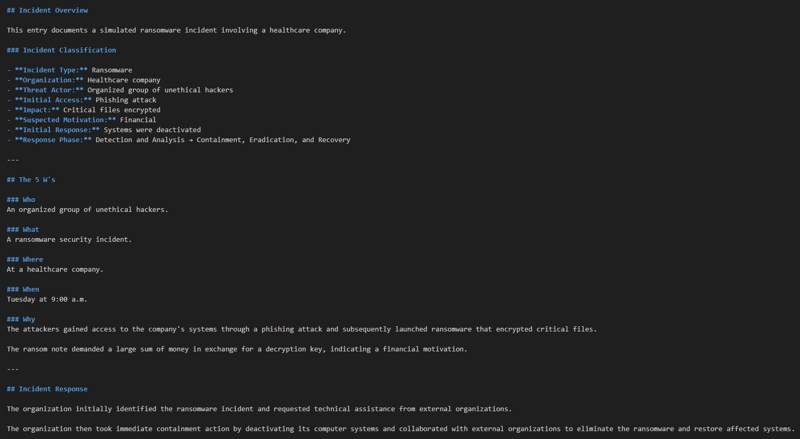
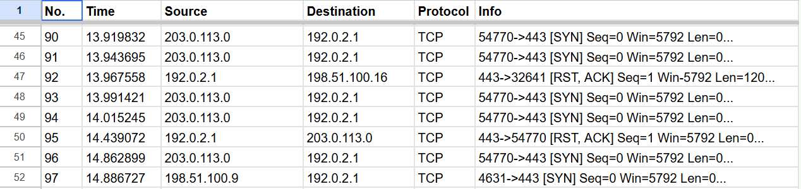
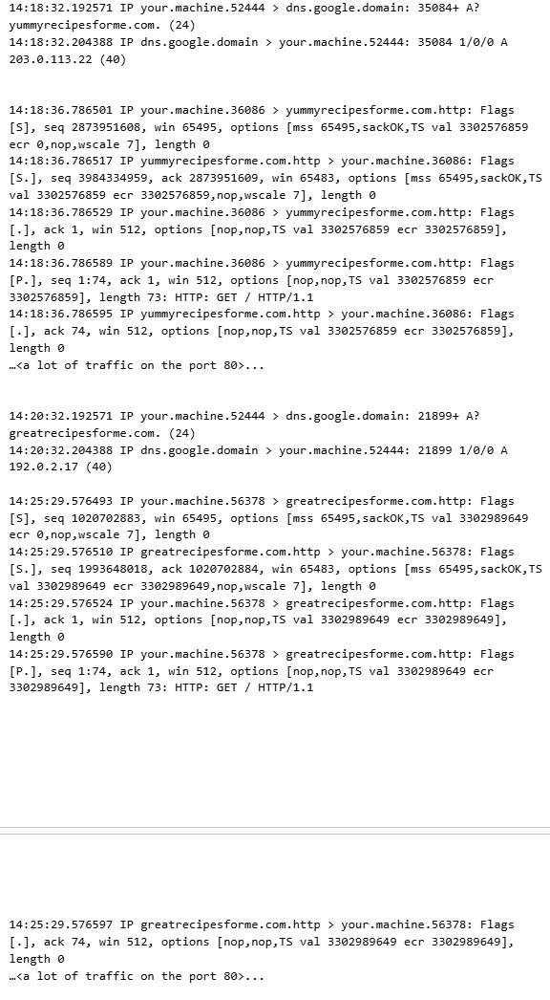

# 🛡️ Incident Handler's Journal

> A cybersecurity incident investigation portfolio documenting ransomware analysis, network traffic analysis, suspicious file investigation, and incident response concepts using Wireshark, tcpdump, and VirusTotal.

---

## 📖 Overview

This project documents a series of cybersecurity investigation exercises completed as part of the Google Cybersecurity Professional Certificate.

The journal covers four primary activities:

- Documenting a ransomware incident
- Analyzing a packet capture with Wireshark
- Capturing network traffic with tcpdump
- Investigating a suspicious file hash with VirusTotal

The original coursework has been reorganized into a portfolio-oriented incident investigation repository.

---

## 🎯 Project Objectives

- Practice structured incident documentation
- Apply the 5 W's to security investigations
- Analyze network traffic
- Investigate indicators of compromise
- Understand incident response phases
- Document investigation findings
- Develop familiarity with security analysis tools

---

## 🚨 Investigations

| Investigation | Focus | Tools |
|---|---|---|
| Ransomware Incident | Incident documentation and response | None |
| Packet Capture Analysis | Network traffic analysis | Wireshark |
| First Packet Capture | Network traffic capture | tcpdump |
| Suspicious File Hash | Indicator investigation | VirusTotal |

---

## 🔄 Incident Response Lifecycle

```
Detection and Analysis
        ↓
Containment
        ↓
Eradication
        ↓
Recovery
```

The ransomware scenario demonstrated detection and analysis followed by containment, eradication, and recovery activities.

---

## 🔬 Investigation Highlights

### Ransomware

A healthcare organization experienced a ransomware incident following a phishing attack. Critical files were encrypted and a ransom demand was issued.

The organization responded by deactivating its computer systems and obtaining external assistance for eradication and recovery.

### Wireshark

A packet capture was analyzed using Wireshark to gain practical experience with graphical network traffic analysis.

### tcpdump

Network traffic was captured and analyzed using tcpdump. The exercise provided practical experience with command-line network analysis.

### VirusTotal

A suspicious file hash associated with an email attachment was investigated using VirusTotal. The hash was reported as malicious, and the scenario represented the Detection and Analysis phase of incident response.

---

## 🛠️ Tools Used

- Wireshark
- tcpdump
- VirusTotal

---

## 📂 Repository Structure

```
incident-handlers-journal/
│
├── incidents/
│   ├── ransomware-incident.md
│   └── malicious-file-investigation.md
│
├── network-analysis/
│   ├── wireshark-analysis.md
│   └── tcpdump-analysis.md
│
├── response/
│   └── incident-response-notes.md
│
├── docs/
│   └── methodology.md
│
├── screenshots/
│   ├── incident-overview.png
│   ├── wireshark-analysis.png
│   └── tcpdump-analysis.png
│
├── LICENSE
├── .gitignore
└── README.md
```

---

## 📸 Project Screenshots

### Incident Investigation

The incident documentation summarizes the ransomware scenario, investigation context, and response actions.



### Wireshark Analysis

The packet log captures TCP connection establishment followed by HTTP request and response traffic.



### tcpdump Analysis

The tcpdump exercise documents command-line network traffic capture and analysis using a packet capture workflow.



---

## 🧠 Skills Demonstrated

- Incident documentation
- Incident response
- Security investigation
- Network traffic analysis
- Packet capture analysis
- Indicator of compromise investigation
- Wireshark
- tcpdump
- VirusTotal
- 5 W's analysis
- Security documentation

---

## 💡 Key Lessons

The exercises strengthened my understanding of the incident response lifecycle and the relationship between security tools, evidence, and investigative decisions.

The tcpdump exercise also demonstrated the importance of carefully reviewing command syntax and methodically troubleshooting incorrect results.

The journal reinforced the importance of structured documentation when investigating security incidents.

---

## 📝 Professional Reflection

My knowledge of incident detection and response developed substantially through these exercises.

The activities provided practical exposure to the incident lifecycle, network traffic analysis, security investigation, and the tools used by security professionals.

Network analysis was particularly challenging because of my limited prior experience with Wireshark and tcpdump. Working through these exercises increased my familiarity with both graphical and command-line network analysis.

---

## ⚠️ Project Limitations

This repository represents educational cybersecurity exercises.

It does not represent an investigation of a real organization's infrastructure.

The project does not include:

- Production security logs
- Complete enterprise packet captures
- Endpoint telemetry
- SIEM data
- Full network architecture
- Production incident-response records

---

## 🙏 Acknowledgment

This project is based on exercises from the Google Cybersecurity Professional Certificate.

The original Incident Handler's Journal has been reorganized and expanded into a portfolio-oriented repository for educational and professional showcase purposes.

---

## 👨‍💻 Author

**Akhilesh Panigrahi**

🎓 Computer Science & Information Security
🛡️ Aspiring Cybersecurity Analyst
📍 United States

---

## 📄 License

This project is licensed under the MIT License.

See the [LICENSE](LICENSE) file for more information.